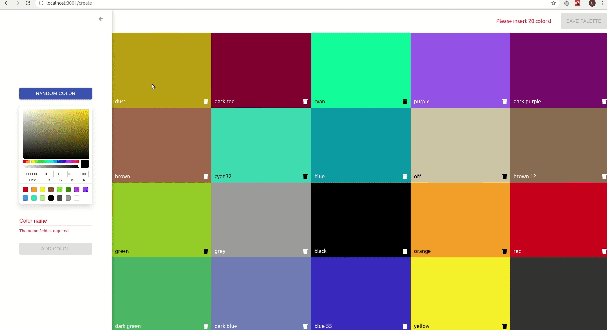

# Color Palette App

A web app to create color palettes. It was made to learn React.js and the enviroment around it. 

### Demos

Color Palette App demo:


Creating a new palette:



## Running the app

First of all make sure you install npm:

```
npm install
```
Start the [fake API](https://github.com/typicode/json-server):


```
npm run start-api
```

Start the application:


```
npm start
```

## Built With

* [React.js](https://reactjs.org/)
* [react-router](https://reacttraining.com/react-router/web/guides/quick-start)
* [styled-components](https://rometools.github.io/rome/)
* [axios](https://github.com/axios/axios)
* [react-sortable-hoc](https://github.com/clauderic/react-sortable-hoc)
* [chroma.js](https://github.com/gka/chroma.js/)
* [react-color](https://casesandberg.github.io/react-color/)
* [emoji-mart](https://github.com/missive/emoji-mart)

## License

This project is licensed under the MIT License - see the [LICENSE.md](LICENSE.md) file for details
